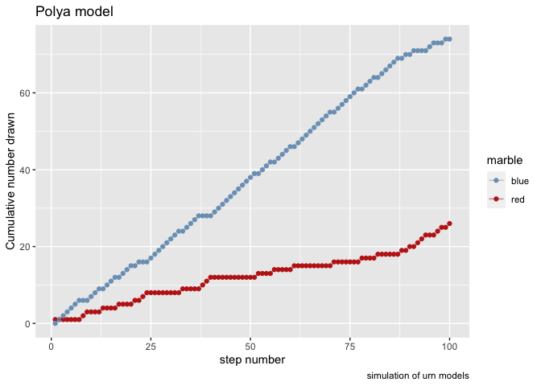
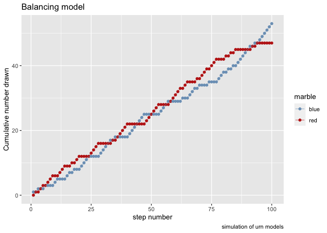
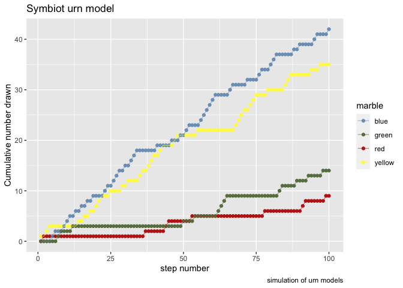

Urn models
================

    library(ggplot2)
    library(tidyr)
    source("../R/urn_models.R") # the functions
    # unfortunately the standard colorset sets red to blue and reverse, so this fixes it.
    set_colors <- scale_color_manual(values=c(red="#c02519",blue="#7ca0c0"))

These are some models based on the coursera course: Model Thinking and
specificly on [this
video](https://www.coursera.org/learn/model-thinking/lecture/ym0VV/urn-models)

Urn models are simple models which can have some complex behavior, the
models are like this

-   you start with an urn (or bag, or whatever a container)
-   there are 2 marbles in the urn (one red, one blue f.i.)
-   you draw a marble, look at it and return it

## Simple model, Bernoulli

Nothing more than description above and basic idea of probability
classes. Every draw is independent.

    urn_bernoulli(iterations = 10)

    ##  [1] "red"  "red"  "blue" "blue" "blue" "blue" "blue" "blue" "red"  "red"

How many of every color would we have if we repeat this proces 100
times?

    urn_plot(cumulative_sum(urn_bernoulli(iterations = 100)))+
        set_colors+
        ggtitle("Bernoulli")

<!-- -->

    urn_plot(cumulative_sum(urn_bernoulli(iterations = 100)))+
        set_colors+
        ggtitle("Bernoulli", subtitle = "another try")

<!-- -->

Because there will always be 1 red and 1 blue ball, the long run
probability of drawing ‘red’ will be 50%.

A look over the prob distribution over many repeats:

    vis_prop_distr(prob_distr_urn(urn_bernoulli,iterations_per_model = 100,repeats = 200))+
        ggtitle("Bernoulli")

<!-- -->

## Extending the model, Polya model

-   you start with an urn (or bag, or whatever a container)
-   there are 2 marbles in the urn (one red, one blue f.i.)
-   you draw a marble, look at it and return it
-   **Add another marble of that color to the bag**

<!-- -->

    urn_polya(iterations = 10)

    ##  [1] "red"  "red"  "blue" "red"  "red"  "blue" "blue" "red"  "red"  "blue"

How many of every color would we have if we repeat this proces 100
times?

    urn_plot(cumulative_sum(urn_polya(iterations = 100)))+
        set_colors+
        ggtitle("Polya model")

<!-- -->

Is it different with a different start?

    urn_plot(cumulative_sum(urn_polya(iterations = 100)))+
        set_colors+
        ggtitle("Polya model", subtitle = "another draw")

<!-- -->

A look over the prob distribution over many repeats:

    vis_prop_distr(prob_distr_urn(urn_polya,iterations_per_model = 100,repeats = 200))+
        ggtitle("Polya",subtitle = "flat distribution, anything is possible")

<!-- -->

## Extending the model, Balancing model

-   you start with an urn (or bag, or whatever a container)
-   there are 2 marbles in the urn (one red, one blue f.i.)
-   you draw a marble, look at it and return it
-   **Add another marble of a different color to the bag**

<!-- -->

    urn_balancing(iterations = 10)

    ##  [1] "blue" "blue" "red"  "red"  "red"  "blue" "blue" "blue" "red"  "red"

How many of every color would we have if we repeat this proces 100
times?

    urn_plot(cumulative_sum(urn_balancing(iterations = 100)))+
        set_colors+
        ggtitle("Balancing model")

<!-- -->

Is it different with a different start?

    urn_plot(cumulative_sum(urn_balancing(iterations = 100)))+
        set_colors+
        ggtitle("Balancing model", subtitle = "another draw")

<!-- -->

A look over the prob distribution over many repeats:

    vis_prop_distr(prob_distr_urn(urn_balancing,iterations_per_model = 100,repeats = 200))+
        ggtitle("Balancing",subtitle = "Prob. moves to equilibrium")

<!-- -->

## Extending the model, Sway model

-   you start with an urn (or bag, or whatever a container)
-   there are 2 marbles in the urn (one red, one blue f.i.)
-   you draw a marble, look at it and return it
-   **Add another marble of that color to the bag**
-   **We add 1 balls of color step back (2^{0})**
-   **We add 2 balls of color 2 steps back (2^{1})**
-   **We add 4 balls of color 3 steps back (2^{2})**
-   **etc. **

In this model the past weights more heavily over time.

    urn_sway(iterations = 10)

    ##  [1] "red" "red" "red" "red" "red" "red" "red" "red" "red" "red"

How many of every color would we have if we repeat this proces 100
times?

    urn_plot(cumulative_sum(urn_sway(iterations = 100)))+
        set_colors+
        ggtitle("Sway model")

<!-- -->

Is it different with a different start?

    urn_plot(cumulative_sum(urn_sway(iterations = 100)))+
        set_colors+
        ggtitle("Sway model", subtitle = "another draw")

<!-- -->

A look over the prob distribution over many repeats:

    vis_prop_distr(prob_distr_urn(urn_sway,iterations_per_model = 100,repeats = 200))+
        ggtitle("Sway",subtitle = "flat distribution, anything is possible")

<!-- -->

## Path dependence and increasing returns, Symbiots urn

    urn_symbiots(iterations = 10)

    ##  [1] "blue"   "blue"   "yellow" "blue"   "yellow" "red"    "blue"   "yellow"
    ##  [9] "yellow" "yellow"

    urn_plot(cumulative_sum(urn_symbiots(iterations = 100)))+
        scale_color_manual(values=c(red="#c02519",blue="#7ca0c0", yellow="#fff855",green="#6a7f50"))+
        ggtitle("Symbiot urn model")

<!-- -->

    urn_plot(cumulative_sum(urn_symbiots(iterations = 100)))+
        scale_color_manual(values=c(red="#c02519",blue="#7ca0c0", yellow="#fff855",green="#6a7f50"))+
        ggtitle("Symbiot urn model", subtitle = "different")

<!-- -->
